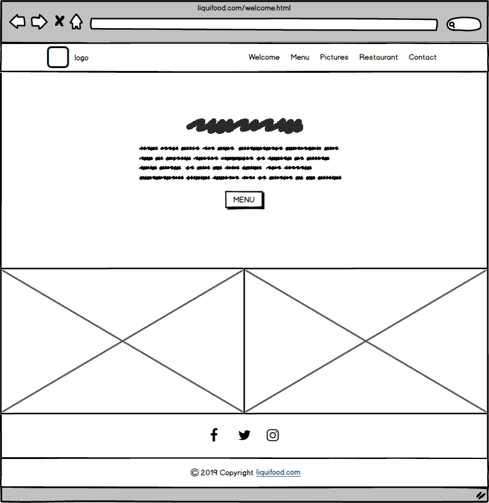
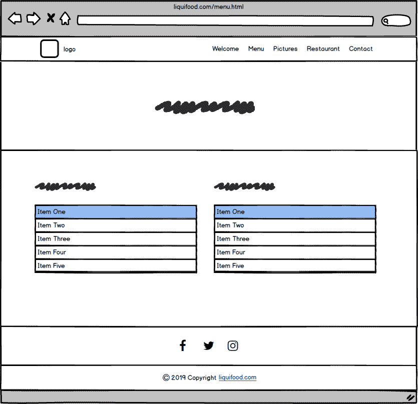
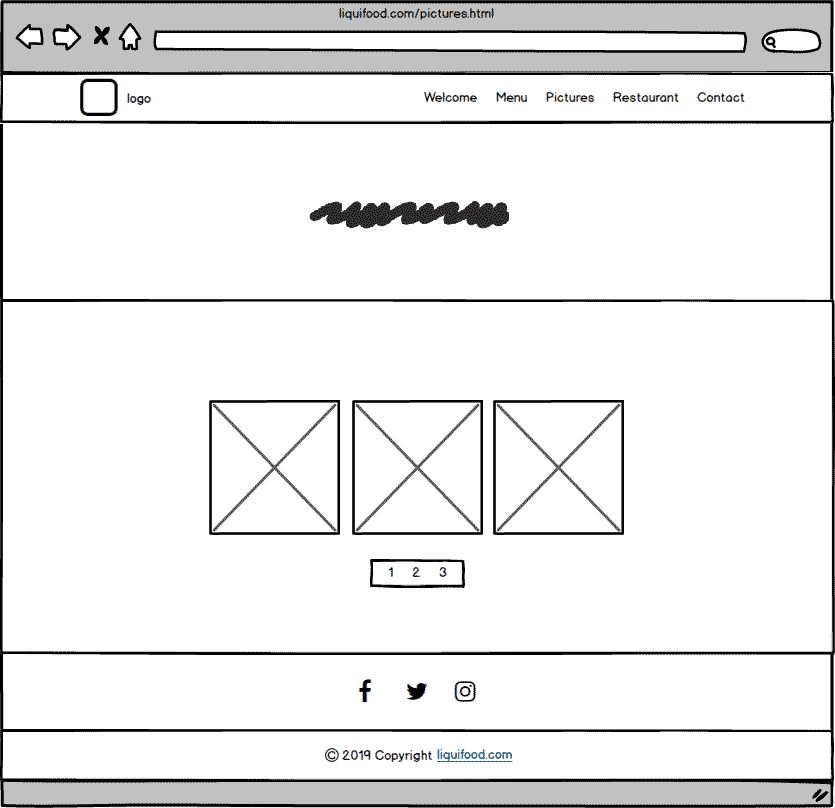
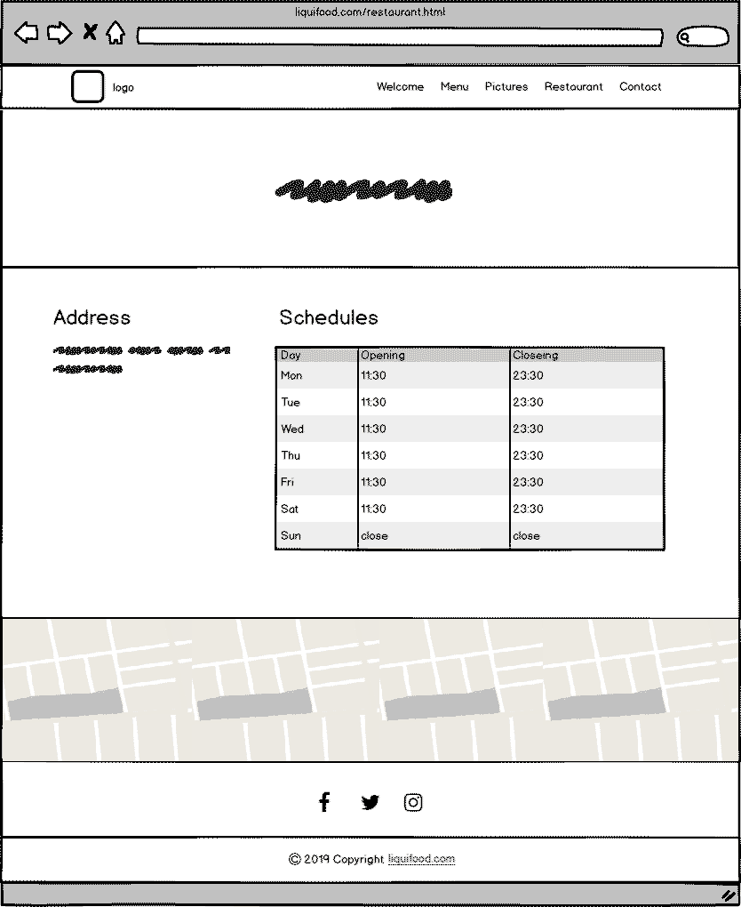
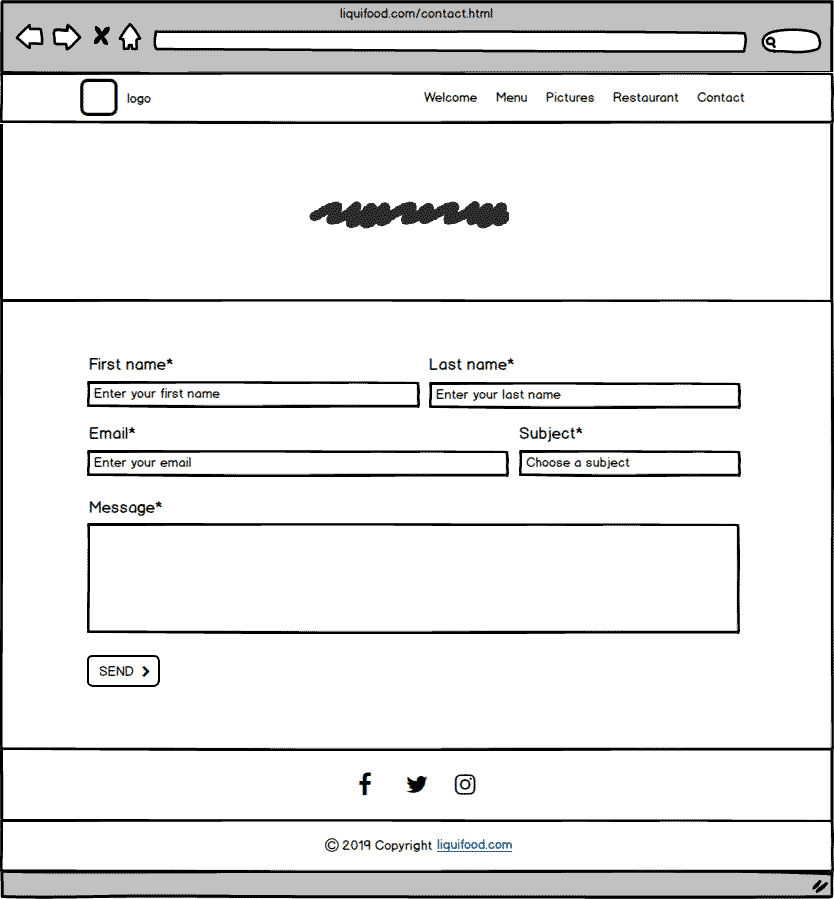

# Restaurant with Bootstrap

LiquiFood is an experimental restaurant based in whatever you are :) serving food in liquid form.
This fictive website is realized using the bootstrap framework, this project is an exercise to familiarize myself to bootstrap and it's class system

## Wireframe

### welcome

### menu

### pictures

### restaurant

### contact

## Objectif

### Welcome
A page with one Jumbotron and two panels to show news (promo, events, etc…​).

### Menu
A page with the restaurant menu in the form of a grouped list with badges.

### Pictures
A page with a gallery of minimum 10 pictures and a pagination (3 photos per page).

### Restaurant
A page about the restaurants (it’s a franchise) with its addresses, a map, and different schedules.

### Contact
A page with a contact form containing the firstname, lastname, email, subject of the message (a drop-down list with multiple options), an area for the message itself and a send button with an icon. Each entry as a title in a semantically correct tag.

To see the website clique: [here](https://wailmadrane.github.io/restaurant-css-framework/)

## Source

Source for image : [pxhere](https://pxhere.com/)